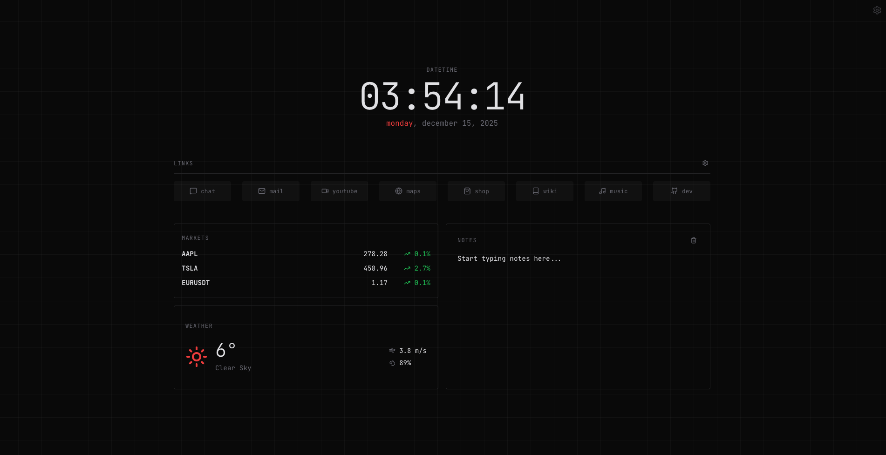

# Zerobyte Dashboard

A minimalist, cyberpunk-inspired personal dashboard built with **React** and **Vite**.



## Features

-   **Customizable Links**: Add, edit, reorder, and delete shortcuts with a rich icon pack.
-   **Live Market Data**: Real-time tracking of crypto and stock assets (via Finnhub).
-   **Local Weather**: Live weather updates for your location (via Open-Meteo).
-   **Quick Notes**: A persistent scratchpad for your thoughts.
-   **Secure**: All settings and data are stored locally in your browser (`localStorage`). No external database required.
-   **Responsive**: Fully mobile-friendly with a dense, auto-fitting grid layout.

## Setup

1.  **Clone the repo**
    ```bash
    git clone https://github.com/59n/zerobyte-dashboard.git
    cd zerobyte-dashboard
    ```

2.  **Install dependencies**
    ```bash
    npm install
    ```

3.  **Run locally**
    ```bash
    npm run dev
    ```

## Configuration

Click the **Gear Icon** (top right) to configure:
-   **Weather**: Set your Latitude and Longitude.
-   **Markets**: Enter your [Finnhub API Key](https://finnhub.io/) (free) and choose up to 3 tickers (e.g., `AAPL`, `BINANCE:BTCUSDT`).

## Deployment

### Netlify (Recommended)

This project is ready for Netlify. The `public/_redirects` file is included for SPA routing support.

1.  Push to GitHub.
2.  Import project in Netlify.
3.  Build command: `npm run build`
4.  Publish directory: `dist`

[](https://app.netlify.com/start/deploy?repository=https://github.com/59n/zerobyte-dashboard)

## License

MIT
